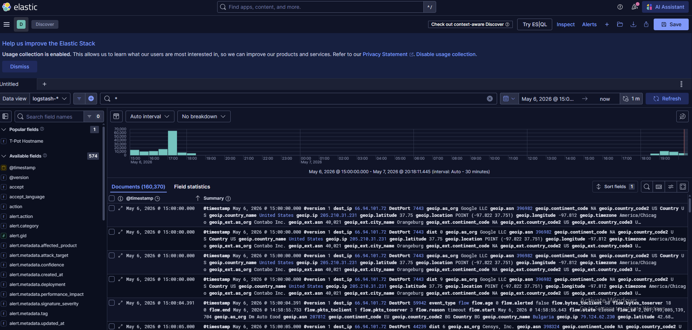

# T-Pot Honeypot Initial Analysis

## Objective

This report documents external scanning and probing activity observed against a T-Pot honeypot deployed on a public Contabo VPS. The goal was to analyze collected telemetry using Kibana, Elastic, and Suricata, then summarize the most relevant findings in a SOC-style format.

## Environment

| Item | Details |
|---|---|
| Platform | T-Pot Honeypot |
| Hosting | Contabo VPS |
| Data Source | Kibana / Elastic / `logstash-*` |
| Tools Used | Kibana Discover, Kibana Query Language (KQL), Suricata |
| Analysis Window | May 6, 2026 15:00 to May 7, 2026 19:00 Eastern Time |

> Note: The public VPS IP is redacted in this report as `<VPS_PUBLIC_IP>`. In Kibana, the actual VPS IP was used when filtering.

### Kibana Overview



---

## Filtering Approach

To focus on external honeypot activity, I filtered out the VPS source IP and the T-Pot dashboard/admin port.

```kql
src_ip: * and not src_ip: "<VPS_PUBLIC_IP>" and not DestPort: 64297
```

This helped remove management-related traffic and focus on external traffic targeting honeypot-facing services.

---

## Summary of Activity

The honeypot received traffic across several exposed services, including Telnet, Hypertext Transfer Protocol (HTTP), Server Message Block (SMB), Hypertext Transfer Protocol Secure (HTTPS), PostgreSQL, Elasticsearch, and MikroTik/RouterOS-related ports.

### Top External Source IPs


### Top Targeted Ports


| Port | Service / Meaning |
|---:|---|
| 23 | Telnet |
| 80 | HTTP |
| 8787 | Uncommon service probing |
| 54320 | High/random port probing |
| 443 | HTTPS |
| 445 | SMB |
| 9200 | Elasticsearch |
| 5432 | PostgreSQL |
| 8728 | MikroTik/RouterOS |

### Top Source Countries


| Country | Share |
|---|---:|
| United States | 56.0% |
| Bulgaria | 6.0% |
| France | 4.6% |
| Netherlands | 3.8% |
| China | 3.4% |
| Seychelles | 3.2% |
| Romania | 3.2% |

These countries represent geolocated source infrastructure, not confirmed attacker origin.

---

## Suricata Alert Overview


The Suricata alert overview showed a high volume of packet, stream, and protocol-related alerts. Most alerts were informational or related to traffic interpretation, but some alerts provided stronger investigation leads, especially the SMBv1-related activity on TCP/445.

---

## Finding 1: SMBv1 Probing on TCP/445

The strongest finding involved Suricata alerts for potentially unsafe Server Message Block version 1 (SMBv1) traffic.

### Evidence

```kql
src_ip: * and not src_ip: "<VPS_PUBLIC_IP>" and not DestPort: 64297 and alert.metadata.signature_severity: "Major"
```


| Field | Value |
|---|---|
| Alert Signature | ET INFO Potentially unsafe SMBv1 protocol in use |
| Signature ID | 2023997 |
| Destination Port | 445 |
| Protocol | Transmission Control Protocol (TCP) |
| Signature Severity | Major |
| Affected Product | Windows XP/Vista/7/8/10/Server 32/64-bit |

### Analysis

All Major-severity alerts in the filtered dataset were related to SMBv1 traffic over TCP/445. The activity came from multiple source IPs and countries, suggesting broad internet scanning or opportunistic probing for exposed SMB services.

### Recommendation

In a production environment, SMBv1 should be disabled and inbound SMB traffic from the internet should be blocked. TCP/445 should only be accessible from trusted internal networks.

---

## Finding 2: Telnet Probing on TCP/23

The honeypot received high-volume traffic on TCP/23, commonly associated with Telnet.

### Evidence

```kql
src_ip: * and not src_ip: "<VPS_PUBLIC_IP>" and not DestPort: 64297 and DestPort: 23
```


| Field | Value |
|---|---|
| Records Reviewed | Approximately 7,800 |
| Application Protocol | Telnet, 100% |
| Event Type | Flow, 98.9% |
| Alert Type | Alert, 1.1% |
| Username Data | Not observed |

### Analysis

The traffic was confirmed as Telnet, but most records were flow events and no username fields were found. This suggests scanning or probing rather than confirmed Telnet brute-force activity.

### Recommendation

Telnet should not be exposed to the internet. Organizations should disable Telnet and use Secure Shell (SSH) with strong authentication instead.

---

## Finding 3: HTTP Probing on TCP/80

The honeypot also observed HTTP activity targeting TCP/80.

### Evidence

```kql
src_ip: * and not src_ip: "<VPS_PUBLIC_IP>" and not dest_port: "64297" and dest_port: 80
```

| Field | Value |
|---|---|
| Top Source IP | 142.93.249.126, 73.5% |
| Top Source Country | United States, 79.5% |
| Application Protocol | HTTP, 88.4% |
| Top Alert | SURICATA HTTP Request excessive header repetition, 58.8% |
| HTTP Method | GET, 99.8% |
| User-Agent | No data found |

### Analysis

The HTTP traffic was heavily concentrated from one source IP and mostly used the GET method. The main Suricata alert involved excessive HTTP header repetition, which suggests automated or malformed web probing.

No User-Agent data was available in the selected records, so the specific scanner or tool could not be identified from HTTP headers.

### Recommendation

Public web services should be monitored for abnormal headers, repetitive requests, and scanner-like behavior. Administrative web interfaces should not be exposed directly to the internet.

---

## Key Takeaways

- T-Pot captured real external scanning activity shortly after exposure.
- The strongest finding was SMBv1-related probing against TCP/445.
- Telnet traffic on TCP/23 showed high-volume probing but no credential evidence.
- HTTP traffic on TCP/80 showed scanner-like behavior and abnormal header activity.
- Filtering out management traffic was necessary to avoid misleading results.
- Source country data should be treated as geolocation of infrastructure, not confirmed attacker attribution.

---

## Lessons Learned

This lab helped practice SOC-style investigation using Kibana, Elastic, and Suricata. The biggest lesson was that honeypot data must be interpreted carefully. High event volume does not always mean high severity, and source IP geolocation should not be treated as confirmed attacker attribution.

This analysis also reinforced the importance of filtering out management-plane traffic before drawing conclusions from honeypot telemetry.
