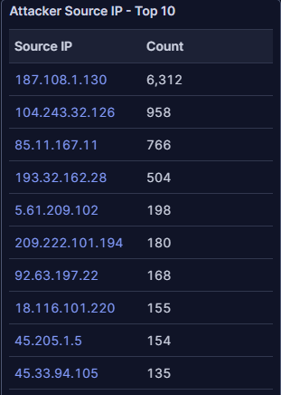
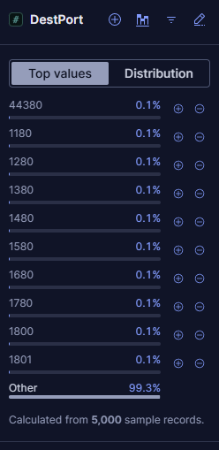
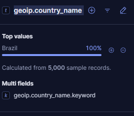
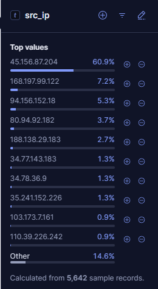
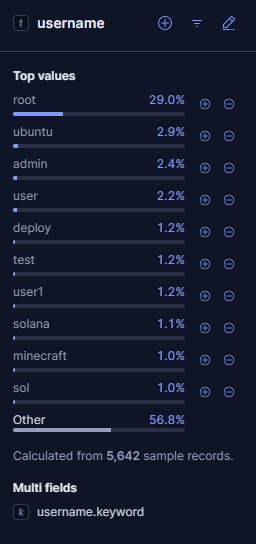
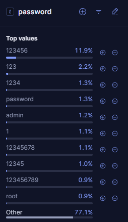
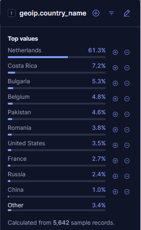
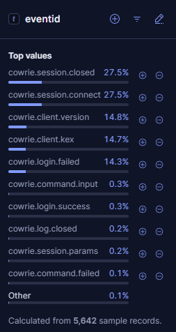
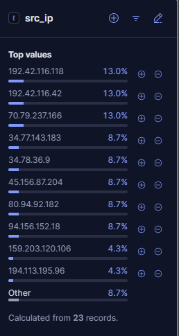
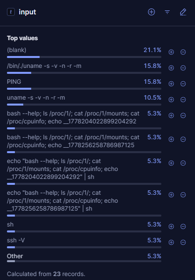

# T-Pot 24-Hour Honeypot Analysis

## Objective

This report documents a 24-hour review of honeypot activity collected from a T-Pot deployment on a public VPS. The goal was to identify the most active honeypots, review notable source activity, and summarize findings in a concise SOC-style format.

## Environment

| Item | Details |
|---|---|
| Platform | T-Pot Honeypot |
| Data Source | Kibana / Elastic / `logstash-*` |
| Tools Used | Kibana Discover, KQL, T-Pot Dashboards |
| Time Range | Last 24 hours |
| Main Honeypots Reviewed | Honeytrap, Cowrie |

---

## Finding 1: Honeytrap Received the Highest Activity

Honeytrap was the most active honeypot during the 24-hour collection window. The dashboard showed Honeytrap receiving the largest share of events, with activity spread across many destination ports.

### Screenshot Evidence




### Key Observations

| Field | Observation |
|---|---|
| Most active honeypot | Honeytrap |
| Top source IP | `187.108.1.130` |
| Top source IP event count | `6,312` |
| Top ASN | LANTEC COMUNICAC |
| Suricata CVE results | No results found |
| Suricata alert signature results | No results found |

### Analysis

Honeytrap activity was heavily concentrated around source IP `187.108.1.130`. Since the dashboard did not show related Suricata CVE or alert signature results, this activity is best described as honeypot interaction and scanning behavior rather than confirmed exploit detection.

---

## Finding 2: Brazil Source IP Performed Broad Port Scanning

A focused review of source IP `187.108.1.130` showed that the traffic was geolocated to Brazil and spread across many destination ports.

### KQL Filter Used

```kql
type.keyword: "Honeytrap" and src_ip: "187.108.1.130"
```

### Screenshot Evidence





### Key Observations

| Field | Observation |
|---|---|
| Source IP | `187.108.1.130` |
| Country | Brazil, 100% |
| Honeypot | Honeytrap |
| Sample size | 5,000 records |
| Destination ports | Highly distributed |
| Other ports | 99.3% |

### Analysis

No single destination port dominated the activity. The `Other` category accounted for 99.3% of sampled records, meaning the source touched many different ports. This pattern is consistent with broad automated port scanning or service discovery rather than a focused attack against one service.

---

## Finding 3: Cowrie Captured SSH Credential Guessing

Cowrie collected thousands of records related to SSH/Telnet-style interaction. The data showed repeated login attempts using common usernames and weak passwords.

### KQL Filter Used

```kql
type.keyword: "Cowrie"
```

### Screenshot Evidence









### Key Observations

| Field | Observation |
|---|---|
| Cowrie documents | 7,689 |
| Top source IP | `45.156.87.204`, 60.9% |
| Top country | Netherlands, 61.3% |
| Top username | `root`, 29.0% |
| Top password | `123456`, 11.9% |

### Top Usernames

| Username | Share |
|---|---:|
| root | 29.0% |
| ubuntu | 2.9% |
| admin | 2.4% |
| user | 2.2% |
| deploy | 1.2% |
| test | 1.2% |

### Top Passwords

| Password | Share |
|---|---:|
| 123456 | 11.9% |
| 123 | 2.2% |
| 1234 | 1.3% |
| password | 1.3% |
| admin | 1.2% |
| 1 | 1.1% |

### Analysis

The Cowrie data shows credential-guessing behavior using common usernames and weak/default passwords. The most common username was `root`, and the most common password was `123456`, which is consistent with automated SSH brute-force attempts against internet-facing systems.

---

## Finding 4: Cowrie Captured Post-Login Reconnaissance Commands

Cowrie also captured a smaller number of command-input events. These commands suggest automated post-login reconnaissance.

### KQL Filter Used

```kql
type.keyword: "Cowrie" and eventid: "cowrie.command.input"
```

### Screenshot Evidence







### Key Observations

| Field | Observation |
|---|---|
| Command input records | 23 |
| `cowrie.command.input` | 0.3% of sampled Cowrie events |
| `cowrie.login.success` | 0.3% of sampled Cowrie events |
| Main command themes | OS, kernel, architecture, CPU, shell, SSH version |

### Notable Commands

| Command / Input | Share |
|---|---:|
| `/bin//uname -s -v -n -r -m` | 15.8% |
| `PING` | 15.8% |
| `uname -s -v -n -r -m` | 10.5% |
| `bash --help; ls /proc/1/; cat /proc/1/mounts; cat /proc/cpuinfo; echo ...` | 5.3% |
| `sh` | 5.3% |
| `ssh -V` | 5.3% |

### Analysis

The captured commands indicate basic system discovery. Commands such as `uname`, `cat /proc/cpuinfo`, `cat /proc/1/mounts`, and `ssh -V` are commonly used to identify system details, runtime environment, CPU information, and available tooling.

This suggests that a small number of sessions progressed beyond login attempts into automated post-login reconnaissance inside the Cowrie honeypot.

---

## Key Takeaways

- Honeytrap received the highest volume of activity in the 24-hour window.
- The top Honeytrap source IP, `187.108.1.130`, generated thousands of events across many destination ports.
- The Honeytrap activity pattern is consistent with broad port scanning or service discovery.
- Cowrie captured credential-guessing activity using weak usernames and passwords.
- Cowrie also captured post-login reconnaissance commands, including `uname`, `ssh -V`, and `/proc` inspection commands.
- Source country data should be treated as infrastructure geolocation, not confirmed attacker attribution.

---

## Recommendations

- Disable direct internet exposure for unnecessary services.
- Block or restrict common management and file-sharing ports from the public internet.
- Disable password-based SSH authentication where possible.
- Use SSH keys and strong access controls for remote administration.
- Monitor for repeated login attempts using usernames such as `root`, `admin`, and `ubuntu`.
- Alert on post-login reconnaissance commands such as `uname`, `cat /proc/cpuinfo`, and `ssh -V`.
- Treat high-volume multi-port activity as potential scanning or service discovery.

---

## Lessons Learned

This 24-hour collection showed the value of leaving a honeypot running long enough to capture meaningful patterns. Honeytrap provided visibility into broad scanning activity, while Cowrie captured credential attacks and post-login command behavior.

The most valuable lesson was that different honeypots answer different investigation questions. Honeytrap helped identify broad port scanning, while Cowrie provided deeper insight into attacker behavior after login attempts.
