# T-Pot Multi-Day Analysis: SIP/VoIP Activity Dominance

## Objective

This report documents a multi-day review of T-Pot honeypot activity collected between May 6, 2026 and May 12, 2026. The goal was to identify the dominant traffic patterns, determine which honeypots received the most activity, and summarize notable findings in a concise SOC-style format.

## Environment

| Item | Details |
|---|---|
| Platform | T-Pot Honeypot |
| Data Source | Kibana / Elastic / `logstash-*` |
| Tools Used | T-Pot Dashboard, Kibana Discover, KQL |
| Analysis Window | May 6, 2026 to May 12, 2026 |
| Approximate Event Volume | 1 million honeypot events |
| Main Honeypot Reviewed | SentryPeer |

---

## Multi-Day Dashboard Overview

The multi-day dashboard showed approximately 1 million honeypot events. The dominant honeypot was SentryPeer, which collected the majority of activity during the review window.

### Screenshot Evidence

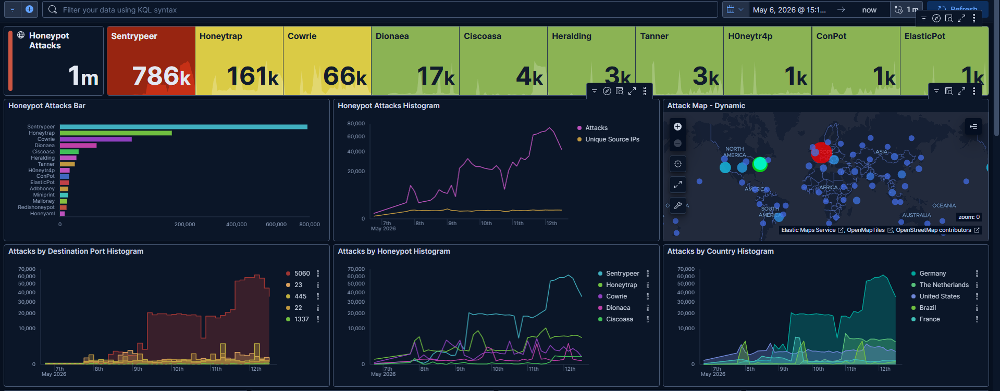

### Top Honeypots

| Honeypot | Approximate Events |
|---|---:|
| SentryPeer | 786k |
| Honeytrap | 161k |
| Cowrie | 66k |
| Dionaea | 17k |
| Ciscoasa | 4k |
| Heralding | 3k |
| Tanner | 3k |
| H0neytr4p | 1k |
| ConPot | 1k |
| ElasticPot | 1k |

### Analysis

The overall dataset was heavily dominated by SentryPeer activity. Since SentryPeer is focused on SIP/VoIP activity, this suggested that a large portion of the multi-day traffic was related to SIP probing or VoIP-focused reconnaissance.

---

## Finding 1: SentryPeer Dominated the Dataset

SentryPeer was the most active honeypot during the multi-day collection window, generating approximately 786k events. This made SIP/VoIP activity the main investigation focus for this report.

### KQL Filter Used

```kql
type.keyword: "SentryPeer"
```

### Screenshot Evidence

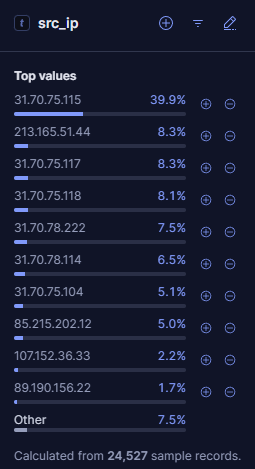

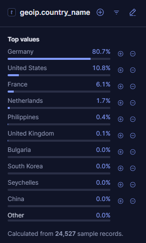

### Top Source IPs

| Source IP | Share |
|---|---:|
| 31.70.75.115 | 39.9% |
| 213.165.51.44 | 8.3% |
| 31.70.75.117 | 8.3% |
| 31.70.75.118 | 8.1% |
| 31.70.78.222 | 7.5% |
| 31.70.78.114 | 6.5% |
| 31.70.75.104 | 5.1% |
| 85.215.202.12 | 5.0% |
| 107.152.36.33 | 2.2% |
| 89.190.156.22 | 1.7% |

### Top Source Countries

| Country | Share |
|---|---:|
| Germany | 80.7% |
| United States | 10.8% |
| France | 6.1% |
| Netherlands | 1.7% |
| Philippines | 0.4% |
| United Kingdom | 0.1% |

### Analysis

SentryPeer activity was highly concentrated around Germany-geolocated infrastructure. Several top source IPs were clustered in related `31.70.75.x` and `31.70.78.x` ranges, suggesting repeated SIP/VoIP probing from related infrastructure.

Source country data should be interpreted as infrastructure geolocation only, not confirmed attacker attribution.

---

## Finding 2: SIP Traffic Targeted Port 5060

All sampled SentryPeer traffic targeted destination port `5060`.

### Screenshot Evidence

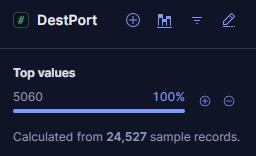

### Key Observation

| Field | Value |
|---|---|
| Destination Port | 5060 |
| Share | 100% |
| Sample Size | 24,527 records |

### Analysis

Port `5060` is commonly associated with SIP signaling. Since SentryPeer is the SIP/VoIP-focused honeypot, this confirms that the dominant activity in the multi-day dataset was SIP/VoIP probing rather than general web, SSH, or random port activity.

---

## Finding 3: SIP Methods Showed ACK, INVITE, and REGISTER Activity

The SentryPeer dataset contained real SIP method activity, not just generic port hits.

### Screenshot Evidence

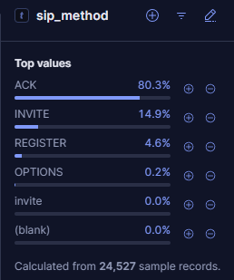

### Top SIP Methods

| SIP Method | Share |
|---|---:|
| ACK | 80.3% |
| INVITE | 14.9% |
| REGISTER | 4.6% |
| OPTIONS | 0.2% |

### Analysis

The dominant method was `ACK`, but the presence of `INVITE` and `REGISTER` is important. `INVITE` is commonly used to initiate a SIP session or call, while `REGISTER` is used when a client attempts to register with a SIP server.

This suggests SIP/VoIP probing and possible toll-fraud reconnaissance. However, no successful call completion, authentication, or fraud was confirmed from this data.

---

## Finding 4: SIP User-Agent Values Suggested VoIP Probing

SentryPeer recorded several SIP user-agent values associated with VoIP phones, SIP clients, and scanning tools.

### Screenshot Evidence

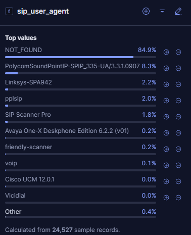

### Top SIP User-Agent Values

| SIP User-Agent | Share |
|---|---:|
| NOT_FOUND | 84.9% |
| PolycomSoundPointIP-SPIP_335-UA/3.3.1.0907 | 8.3% |
| Linksys-SPA942 | 2.2% |
| pplsip | 2.0% |
| SIP Scanner Pro | 1.8% |
| Avaya One-X Deskphone Edition 6.2.2 (v01) | 0.2% |
| friendly-scanner | 0.2% |
| voip | 0.1% |

### Analysis

Most events did not include a user-agent. However, the observed user-agent values included strings associated with VoIP devices, SIP clients, and scanner-like tools.

These values should be treated as observed or claimed user-agent strings, not proof of the actual device or software used. SIP user-agent values can be spoofed.

---

## Finding 5: SIP Messages Referenced Phone-Number-Like URIs

SentryPeer captured SIP messages with real SIP structure, including `ACK` messages, `Call-ID` values, and SIP URIs.

### Screenshot Evidence

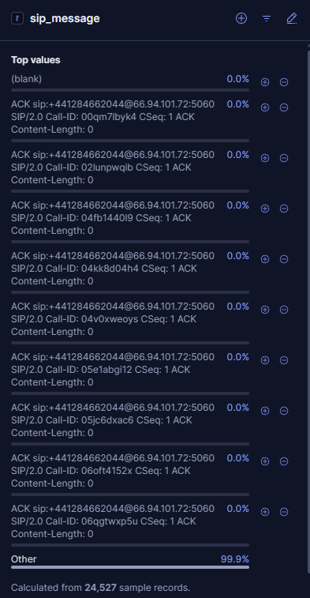

### Example Pattern

```text
ACK sip:+441284662044@[REDACTED_VPS_IP]:5060 SIP/2.0
Call-ID: <unique value>
CSeq: 1 ACK
Content-Length: 0
```

### Analysis

The SIP messages included phone-number-like SIP URIs beginning with `+44`, which is consistent with an international phone number format. This may indicate attempted VoIP call-routing or toll-fraud probing behavior.

Because the dataset does not prove successful call completion or fraud, this activity is best classified as suspicious SIP/VoIP probing rather than confirmed abuse.

---

## Finding 6: INVITE Traffic Showed More Focused SIP Probing

A focused review of `INVITE` traffic showed nearly 10,000 records. Since `INVITE` is used to initiate SIP sessions, this subset was reviewed separately.

### KQL Filter Used

```kql
type.keyword: "SentryPeer" and sip_method: "INVITE"
```

### Screenshot Evidence

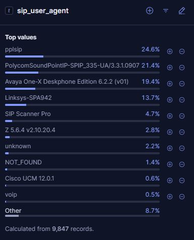

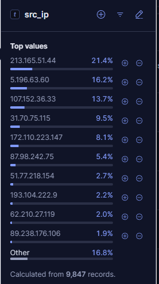

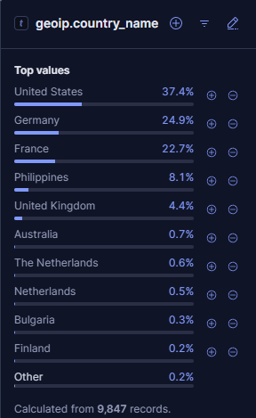

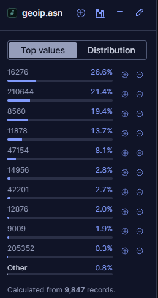

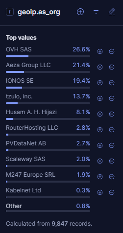

### INVITE Dataset

| Field | Observation |
|---|---|
| Records | 9,847 |
| Main Method | INVITE |
| Main Activity Type | SIP session/call initiation probing |

### Top INVITE User-Agent Values

| SIP User-Agent | Share |
|---|---:|
| pplsip | 24.6% |
| PolycomSoundPointIP-SPIP_335-UA/3.3.1.0907 | 21.4% |
| Avaya One-X Deskphone Edition 6.2.2 (v01) | 19.4% |
| Linksys-SPA942 | 13.7% |
| SIP Scanner Pro | 4.7% |
| Z 5.6.4 v2.10.20.4 | 2.8% |
| unknown | 2.2% |
| NOT_FOUND | 1.4% |

### Top INVITE Source IPs

| Source IP | Share |
|---|---:|
| 213.165.51.44 | 21.4% |
| 5.196.63.60 | 16.2% |
| 107.152.36.33 | 13.7% |
| 31.70.75.115 | 9.5% |
| 172.110.223.147 | 8.1% |
| 87.98.242.75 | 5.4% |
| 51.77.218.154 | 2.7% |
| 193.104.222.9 | 2.2% |
| 62.210.27.119 | 2.0% |
| 89.238.176.106 | 1.9% |

### Top INVITE Source Countries

| Country | Share |
|---|---:|
| United States | 37.4% |
| Germany | 24.9% |
| France | 22.7% |
| Philippines | 8.1% |
| United Kingdom | 4.4% |

### Top INVITE Source Organizations

| Organization | Share |
|---|---:|
| OVH SAS | 26.6% |
| Aeza Group LLC | 21.4% |
| IONOS SE | 19.4% |
| tzulo, inc. | 13.7% |
| Husam A. H. Hijazi | 8.1% |
| RouterHosting LLC | 2.8% |
| PVDataNet AB | 2.7% |
| Scaleway SAS | 2.0% |
| M247 Europe SRL | 1.9% |

### Analysis

The `INVITE` traffic was concentrated across several hosting and infrastructure providers. This supports the assessment that SIP probing came largely from hosted infrastructure rather than clearly residential-looking traffic.

The observed user-agent values included SIP clients, VoIP phone strings, and scanner-like labels. This suggests automated SIP reconnaissance, possible call-initiation probing, and potential toll-fraud reconnaissance.

No successful call completion, authentication, or fraud was confirmed.

---

## Supporting Observations

Although SentryPeer dominated the multi-day dataset, other honeypots still collected meaningful activity:

| Honeypot | Activity Type |
|---|---|
| Honeytrap | Broad port scanning and service discovery |
| Cowrie | SSH/Telnet credential guessing and command capture |
| Dionaea | Malware/exploit-style service interaction |
| Tanner | Web application probing |

These supporting patterns were consistent with earlier reports and reinforce that the VPS was receiving broad internet-wide scanning across multiple exposed services.

---

## Key Takeaways

- The multi-day dataset contained approximately 1 million honeypot events.
- SentryPeer was the dominant honeypot, with approximately 786k events.
- SentryPeer traffic targeted SIP port `5060` in 100% of sampled records.
- SIP methods included `ACK`, `INVITE`, `REGISTER`, and `OPTIONS`.
- The presence of `INVITE` and `REGISTER` suggests SIP/VoIP probing and possible toll-fraud reconnaissance.
- SIP user-agent values included claimed VoIP device/software strings and scanner-like values.
- INVITE traffic was concentrated across several source IPs, countries, and hosting providers.
- No successful fraud, call completion, or compromise was confirmed.

---

## Recommendations

- Do not expose SIP services directly to the internet unless required.
- Restrict SIP access to trusted providers, VPNs, or allowlisted networks.
- Monitor SIP traffic for high-volume `INVITE`, `REGISTER`, and abnormal `ACK` patterns.
- Alert on repeated SIP activity from hosted infrastructure or known scanner sources.
- Review SIP logs for repeated phone-number-like URIs, unusual call destinations, or registration attempts.
- Use strong authentication and rate limiting on VoIP infrastructure.
- Treat SIP user-agent strings as untrusted because they can be spoofed.

---

## Lessons Learned

This multi-day collection showed how quickly internet-facing honeypots can reveal large-scale scanning patterns. Earlier reports focused on Honeytrap and Cowrie, but the longer collection window showed that SIP/VoIP activity was the dominant pattern.

The biggest lesson from this analysis is that different honeypots reveal different attacker behaviors. Honeytrap showed broad port scanning, Cowrie showed credential guessing and post-login commands, and SentryPeer showed SIP/VoIP probing at scale.

The data also reinforced the importance of careful wording. Honeypot telemetry can show scanning, probing, and suspicious behavior, but it should not be overstated as confirmed compromise or successful fraud without supporting evidence.
