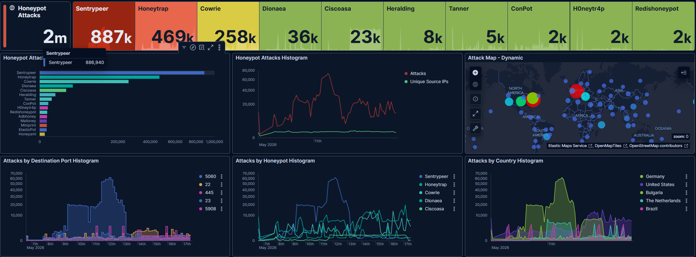
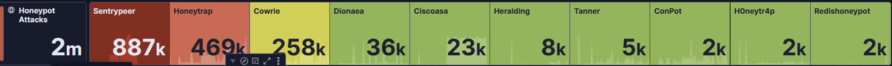
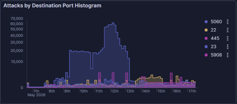
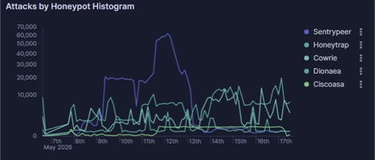
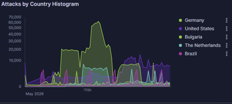

# T-Pot Multi-Service Honeypot Overview

## Objective

This report provides a high-level review of a multi-day T-Pot honeypot dataset collected from May 6, 2026 to May 17, 2026. The goal was to summarize the overall attack volume, identify the most active honeypots, review top targeted services, and determine which areas deserve deeper investigation.

This report is intended as an overview. Detailed Cowrie credential and payload analysis will be documented separately in a dedicated Cowrie deep-dive report.

## Environment

| Item | Details |
|---|---|
| Platform | T-Pot Honeypot |
| Data Source | Kibana / Elastic / `logstash-*` |
| Tools Used | T-Pot Dashboard, Kibana Discover, KQL |
| Analysis Window | May 6, 2026 to May 17, 2026 |
| Approximate Event Volume | 2 million honeypot events |
| Main Honeypots Observed | SentryPeer, Honeytrap, Cowrie, Dionaea, Ciscoasa |

---

## Dashboard Overview

The T-Pot dashboard showed approximately 2 million honeypot events during the collection window. Activity was distributed across multiple honeypots, with SentryPeer, Honeytrap, and Cowrie producing the highest event volumes.

### Screenshot Evidence



---

## Top Honeypots by Activity

SentryPeer, Honeytrap, and Cowrie were the three most active honeypots in the dataset.

### Screenshot Evidence



| Honeypot | Approximate Events | Primary Activity Type |
|---|---:|---|
| SentryPeer | 887k | SIP/VoIP probing |
| Honeytrap | 469k | Broad port scanning and service discovery |
| Cowrie | 258k | SSH/Telnet credential activity and command interaction |
| Dionaea | 36k | Malware/exploit-style service interaction |
| Ciscoasa | 23k | Cisco ASA-style probing |
| Heralding | 8k | Credential collection across common services |
| Tanner | 5k | Web application probing |
| ConPot | 2k | Industrial control system probing |
| H0neytr4p | 2k | General honeypot activity |
| Redishoneypot | 2k | Redis probing |

### Analysis

The activity was not limited to one service or one honeypot type. The dataset showed broad internet-facing exposure across VoIP/SIP, SSH/Telnet, web services, file-sharing protocols, and other commonly scanned services.

SentryPeer remained the most active honeypot, showing that SIP/VoIP probing continued to dominate the environment. Honeytrap also collected a large amount of broad scanning activity, while Cowrie grew significantly and became a strong source of credential and post-login telemetry.

---

## Finding 1: SIP/VoIP Activity Remained the Largest Pattern

SentryPeer generated approximately 887k events, making it the most active honeypot in the dataset.

SentryPeer is focused on SIP/VoIP activity. This means the largest traffic pattern observed during this collection window was related to SIP probing, VoIP reconnaissance, or possible toll-fraud scanning.

### Key Observations

| Field | Observation |
|---|---|
| Top honeypot | SentryPeer |
| Approximate events | 887k |
| Main service type | SIP/VoIP |
| Most relevant port | 5060 |

### Analysis

The high SentryPeer volume suggests sustained SIP/VoIP probing against the honeypot. This is consistent with earlier findings where SentryPeer traffic targeted SIP port `5060` and included SIP methods such as `ACK`, `INVITE`, and `REGISTER`.

This activity should be described as SIP/VoIP probing or reconnaissance. It should not be described as confirmed fraud or compromise without evidence of successful call completion, authentication, or service abuse.

---

## Finding 2: Honeytrap Captured Broad Port Scanning

Honeytrap generated approximately 469k events, making it the second most active honeypot.

Honeytrap is useful for identifying broad service discovery and scanning behavior across many ports. Its high event volume suggests continued automated scanning against exposed services.

### Key Observations

| Field | Observation |
|---|---|
| Honeypot | Honeytrap |
| Approximate events | 469k |
| Main activity type | Broad port scanning / service discovery |

### Analysis

Honeytrap activity indicates that external sources were scanning across multiple services rather than focusing on one single application. This is typical for internet-facing systems, where automated scanners constantly search for exposed ports, misconfigured services, and known targets.

---

## Finding 3: Cowrie Became a Strong Source of SSH/Telnet Telemetry

Cowrie generated approximately 258k events, making it the third most active honeypot.

Cowrie is valuable because it captures SSH/Telnet-style activity, including connection attempts, usernames, passwords, successful honeypot logins, and command input.

### Key Observations

| Field | Observation |
|---|---|
| Honeypot | Cowrie |
| Approximate events | 258k |
| Main activity type | SSH/Telnet credential guessing and post-login behavior |
| Follow-up report needed | Yes |

### Analysis

The Cowrie event volume is now large enough to support a separate deep-dive report. Early review showed failed logins, successful honeypot logins, command input, payload download attempts, and file download hashes.

Because this activity contains more detailed attacker behavior, it should be documented separately instead of being compressed into this overview report.

---

## Finding 4: Top Destination Ports Showed Multi-Service Probing

The dashboard showed activity across several important destination ports.

### Screenshot Evidence



| Port | Likely Service / Meaning |
|---:|---|
| 5060 | SIP/VoIP |
| 22 | SSH |
| 445 | SMB |
| 23 | Telnet |
| 5908 | VNC/remote-access-related probing |

### Analysis

The top destination ports show that the honeypot was targeted across multiple attack surfaces. SIP/VoIP activity dominated, but SSH, SMB, Telnet, and remote-access-related probing were also visible.

This supports the conclusion that the VPS was exposed to broad internet scanning and automated service discovery across multiple protocols.

---

## Finding 5: Activity Increased Over Time

The dashboard timeline showed sustained activity across the collection window, with visible spikes around the middle of the dataset.

### Screenshot Evidence



### Key Observations

| Observation | Meaning |
|---|---|
| Event volume increased over time | The honeypot continued attracting scanners after exposure |
| Major spikes appeared in the timeline | Large scanning bursts occurred during the collection window |
| SentryPeer drove the largest activity pattern | SIP/VoIP probing was the biggest contributor |

### Analysis

The timeline suggests that the honeypot continued to receive regular unsolicited traffic after deployment. This reinforces the value of multi-day collection because longer runtimes reveal stronger patterns than short collection windows.

---

## Finding 6: Source Countries Showed Broad Internet Exposure

The dashboard showed traffic from multiple geolocated source countries.

### Screenshot Evidence



### Analysis

The country histogram helps show that the honeypot received traffic from multiple regions and infrastructure locations. This should be interpreted as source infrastructure geolocation, not confirmed attacker origin.

---

## Supporting Observations

Other honeypots also collected useful activity:

| Honeypot | Interpretation |
|---|---|
| Dionaea | Possible malware/exploit-style interaction against common services |
| Ciscoasa | Probing related to Cisco ASA-style targets |
| Heralding | Credential attempts across common services |
| Tanner | Web application probing |
| ConPot | Industrial control system-style probing |
| Redishoneypot | Redis-related probing |

These supporting honeypots show that the environment received diverse probing beyond the top three categories.

---

## Key Takeaways

- The honeypot collected approximately 2 million events during the review window.
- SentryPeer was the most active honeypot, showing sustained SIP/VoIP probing.
- Honeytrap showed large-scale broad port scanning and service discovery.
- Cowrie grew significantly and now has enough telemetry for a separate SSH/Telnet deep dive.
- Top destination ports included SIP, SSH, SMB, Telnet, and remote-access-related services.
- The dataset shows broad internet-wide scanning across multiple protocols.
- Source activity should be interpreted as infrastructure telemetry, not confirmed attacker attribution.

---

## Recommendations

- Continue separating broad overview reports from deep-dive investigations.
- Treat SIP/VoIP exposure as high-noise and high-interest because of the large SentryPeer volume.
- Monitor SSH/Telnet activity closely, especially Cowrie successful logins, command input, and file downloads.
- Avoid exposing unnecessary services directly to the internet.
- Restrict management services using trusted IPs, VPN, or other access controls.
- Alert on repeated credential guessing, payload download commands, and abnormal service probing.
- Use passive enrichment for source IPs, ASNs, and file hashes. Do not scan or retaliate against external sources.

---

## Next Investigation

The next report should focus on Cowrie telemetry.

Suggested report:

```text
005 - Cowrie Credential and Payload Analysis
```

Planned focus areas:

- Cowrie event breakdown
- Top usernames and passwords
- Successful honeypot logins
- Command input
- BusyBox checks
- `wget`, `chmod`, and shell execution attempts
- File download events
- Payload hashes
- Source IP and country distribution

---

## Lessons Learned

This multi-service overview showed that a longer-running honeypot provides a much stronger picture of internet-facing attack patterns. Short collection windows can show isolated scans, but multi-day collection reveals which services are targeted most often and which honeypots provide the richest telemetry.

The most important lesson is that each honeypot answers a different question. SentryPeer shows SIP/VoIP probing at scale, Honeytrap shows broad scanning, and Cowrie shows deeper attacker behavior such as credential guessing, command execution, and payload attempts.
